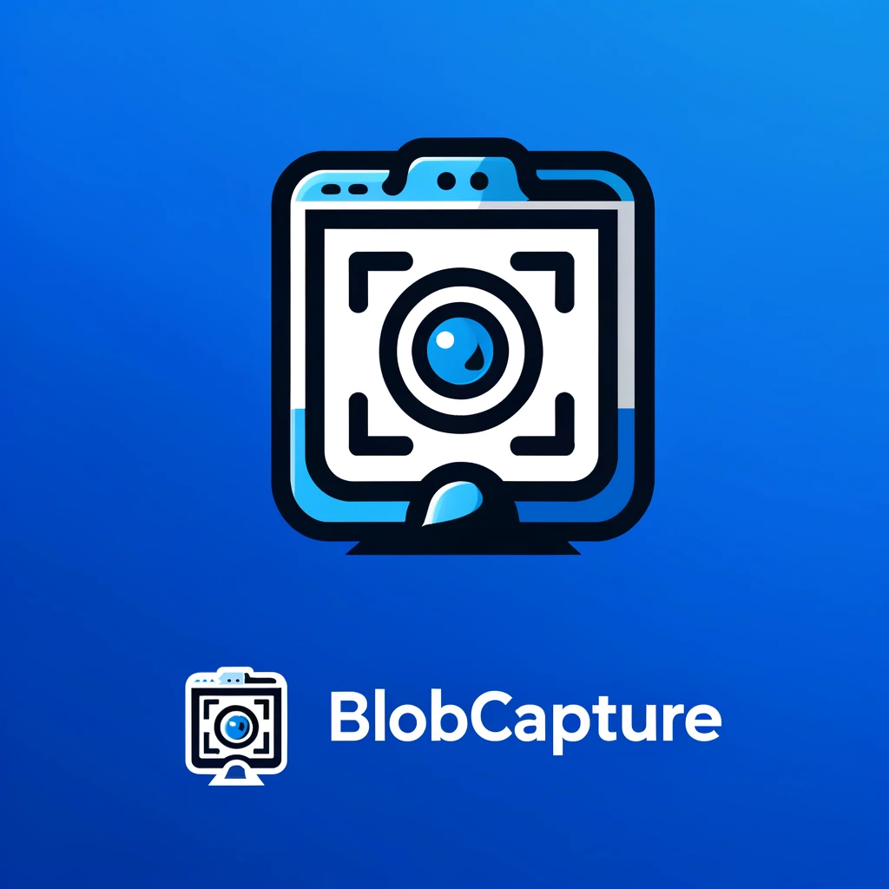

# BlobCapture

BlobCapture is a simple and efficient screenshot capture tool designed to quickly capture any selected region of your screen and store the image in a format that can be easily used for database storage. The tool is lightweight and user-friendly, making it perfect for developers or anyone who needs a fast way to capture and manage screenshots for database applications.

If you need to convert the base64 encoded screenshots back into image format, you can use [this website](https://base64.guru/converter/decode/image).

## Why I Built This Application

BlobCapture was created to simplify the process of handling images for database storage. Instead of saving screenshots to the file system and then uploading them to a database, this tool allows users to directly capture screenshots in a format that can be easily converted and stored as BLOBs in a database. This reduces the need for file management and makes database integration smoother, particularly for developers who need to manage images efficiently.

## Target Audience

This tool is designed for:
- **Developers** who work with database applications and need a quick and efficient way to manage screenshots.
- **Database Administrators** looking to simplify the process of storing images in databases.
- **Data Analysts** who want to document visual data directly into databases without file system dependencies.
- **General users** who need an easy way to capture and prepare images for database use.

## Key Features
- Capture any selected region of the screen.
- Copy the screenshot to the clipboard in Base64 format for easy use in databases.
- Designed to streamline image handling for database storage (BLOB format).
- Lightweight, user-friendly interface with a simple button to take screenshots.

## Technologies Used
- **Python**: The core language for scripting and implementing the screenshot tool.
- **Tkinter**: Used to create the GUI (Graphical User Interface).
- **Pillow**: For image processing and screenshot capture functionality.
- **PyInstaller**: Used to package the application as a standalone `.exe` file.
- **Base64 Encoding**: For easy conversion of screenshots to formats suitable for database storage.

## How to Use
1. Download the BlobCapture.exe file from the repository or clone the project.
2. Run the `.exe` file.
3. Click on the "Select Image" button to capture a screenshot of the desired region.
4. The captured screenshot will be automatically copied to the clipboard in Base64 format and can easily be used for storing in databases.

## Future Improvements
- Add multi-language support for better accessibility.
- Enhance the GUI with more customization options like changing the screenshot format (PNG, JPEG, etc.).
- Integrate cloud storage options to save screenshots directly to cloud databases.

## Platform Compatibility
**Note**: BlobCapture is currently only compatible with **Windows**. It does not support **MacOS** or other operating systems.

## Contributions
Contributions are welcome! If you have any suggestions or improvements, feel free to open a pull request or submit an issue.

## License
This project is open-source and available under the [MIT License](LICENSE).
